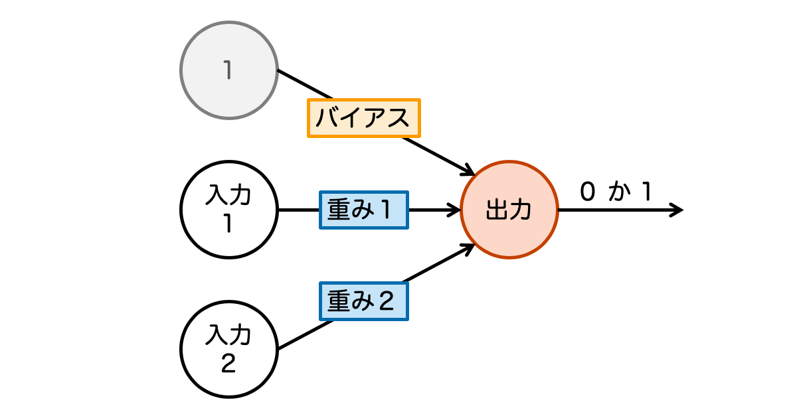
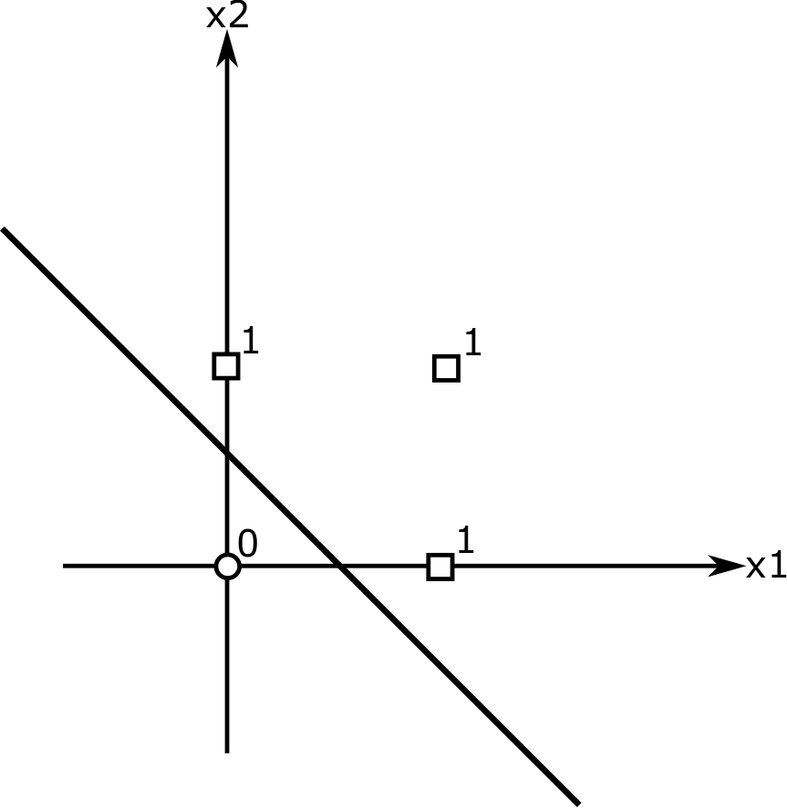
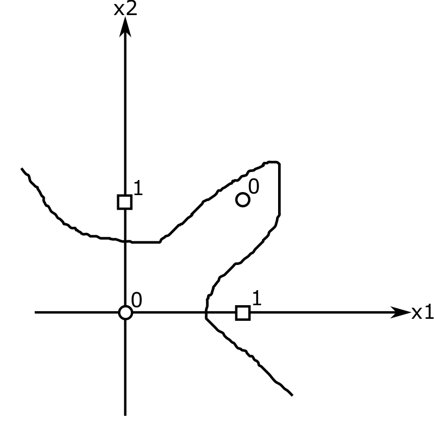

# ニューラルネットワークについて
<br>
<br>

## AIの歴史
ここでニューロンの説明
<br>

## パーセプトロン

<br>
パーセプトロンとは、複数の信号を入力として受け取り、  
ひとつの信号を出力するもの  
脳のニューロンを模しています
<br>

## 重み

<br>
重みとは入力の値に掛け算をするものです。  
機械学習とはこの値を決定していくものと考えておｋ。  
↓上の図を式にしたもの  

<br>
y:出力 w:重み x:入力 b:バイアス(底上げ)
<br>

## ニューラルネットワーク

<br>
パーセプトロンを複数にしたもの。マルチパーセプトロンともいう。  
出力層には活性化関数がある。活性化関数とは、  
説明書いておく予定
<br>

## 実際にニューラルネットワークを作ろう
実装のモデルとして論理回路を使います。  
論理回路とは、複数の入力の値からひとつの出力を出すものです。  
上のパーセプトロンと同じ感じがします。  
身近なもので、照明のスイッチがあげられます。  

<br>
ではコマンドプロンプトを開きましょう。homeボタンを押して、cmdと入力してEnterキーを押しましょう。  
場所を移動しましょう。cd Desktop で作業の場所をデスクトップにします。  
```
C:\User>cd Desktop\

C:\User\Desktop>
```
デスクトップには kouza10-26 というフォルダがあります。ここに移動します。
```
C:\User\Desktop>cd kouza10-26

C:\User\Desktop\kouza10-26>
```
ここでPythonスクリプト(プログラム)を作ります。  
メモ帳を開きましょう。  
まず、論理回路のAND回路を作ります。  
```python
def AND(x1, x2):
  if x1 == 1 and x2 == 1:
    return 1#入力の両方が1なら1を返す
  else:
    return 0#それ以外に0を返す
```
保存するときはファイルの種類を すべてのファイル に指定して、  
logic.py という名前で保存します。  
今作ったものを使ってみましょう。  
cmdで python と入力しましょう。  
```
C:\User\Desktop\kouza10-26>python
Python 3.7.3 ~~~~~~~~~~~~~~~~~~~~~~~~~
~~~~~~~~~~~~~~~~~~~~~~~~~~~~~~~~~~~~~~
~~~~~~~~~~~~~~~~~~~~~~~~~~~~~~~~~~~~~~
>>> from logic import *
>>> AND(0,0)
0
>>> AND(1,0)
0
>>> AND(0,1)
0
>>> AND(1,1)
1
>>> exit()
```
AND回路の真理値表どおりになったと思います。  
次にOR回路を作ります。  
さっきの logic.py を開き続きを書きましょう。  
```python
def AND(x1, x2):
  if x1 == 1 and x2 == 1:
    return 1
  else:
    return 0

def OR(x1, x2):
  if x1 == 1 or x2 == 1:
    return 1#入力のどちらかが1なら1を返す
  else:
    return 0#それ以外に0を返す
```
さっきと同じように使ってみましょう。  
```
C:\User\Desktop\kouza10-26>python
Pthon 3.7.3~~~~~~~~~~~~~~~~~~~~~~~~~~~
~~~~~~~~~~~~~~~~~~~~~~~~~~~~~~~~~~~~~~
~~~~~~~~~~~~~~~~~~~~~~~~~~~~~~~~~~~~~~
>>> from logic import *
>>> OR(0,0)
0
>>> OR(1,0)
1
>>> OR(0,1)
1
>>> OR(1,1)
1
>>> exit()
```
確認できたと思います。  
最後にNOT回路を作ります。  
同じようにlogic.pyに追記しましょう。  
```python
def AND(x1, x2):
  if x1 == 1 and x2 == 1:
    return 1
  else:
    return 0

def OR(x1, x2):
  if x1 == 1 or x2 == 1:
    return 1#入力のどちらかが1なら1を返す
  else:
    return 0#それ以外に0を返す

  def NOT(x):
    if x == 0:
      return 1#入力が0のとき1を返す
    else:
      return 0#入力が1のとき0を返す
```
使ってみましょう。  
```
C:\User\Desktop\kouza10-26>python
Pthon 3.7.3~~~~~~~~~~~~~~~~~~~~~~~~~~~
~~~~~~~~~~~~~~~~~~~~~~~~~~~~~~~~~~~~~~
~~~~~~~~~~~~~~~~~~~~~~~~~~~~~~~~~~~~~~
>>> from logic import *
>>> NOT(1)
0
>>> NOT(0)
1
>>> x = OR(1,1) ←xにOR(1,1) = 1 を代入
>>> NOT(x)
0
>>> exit()
```
<br>
ニューラルネットワークとは上のほうで書いてあるとおり、  
複数のパーセプトロンを組み合わせたものです。  
論理回路でも複数の回路を組み合わせて  
作ることができる回路があります。  
XOR回路とは、入力がすべて同じなら0を返す回路です。  

<br>
なぜ複数のパーセプトロンが必要かというと、
XORが非線形だからです。  
OR回路をグラフで表すと、  

<br>
になります。  
これは直線で1と0を分ける事ができるので、線形であると言えます。
一方XORは直線で分けることができません。  

<br>
なのでパーセプトロンを複数使うことでXORを実装することになります。  
<br>

<br>
↑がXOR回路です。今までの回路をもとにXORをpythonで作りましょう。  

↓答え<br>
↓<br>
↓<br>
↓<br>
↓<br>
↓<br>
↓<br>
↓<br>
↓<br>
↓<br>
↓<br>
↓<br>
↓<br>
↓<br>
↓<br>
↓<br>
↓<br>
↓<br>
```python
def XOR(x1, x2):

```
<br>
<br>
[前へ](../01first/page.md)・[次へ](../03third/page.md)
<br>
<br>
[HOME](../index.md)
