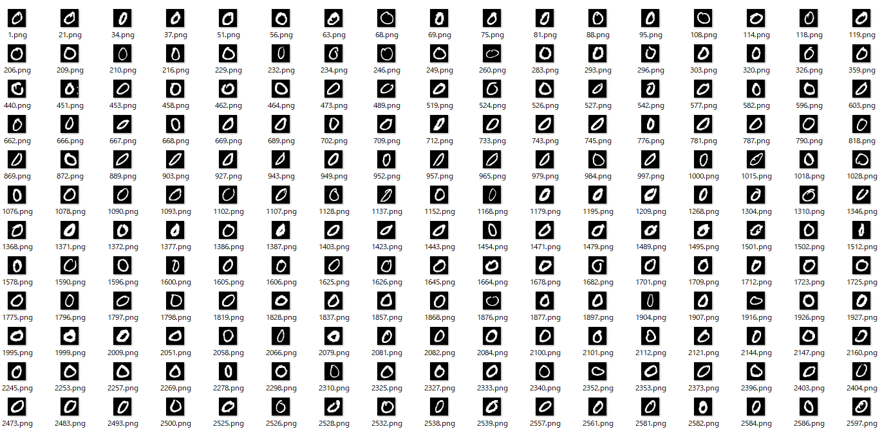
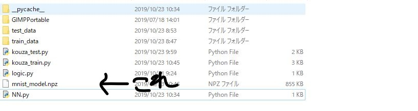

# 実際にやってみよう

## 学習
今回の講座は、0から1の数字を識別する教師あり学習の画像分類です。  
教師あり学習とは、正解の情報付きのデータを学習することです。  
0から9までの画像に正解の情報をつけて学習します。  
学習に用いるデータはmnistという0から9の画像です。  
数は学習用の60000個と、検証用の10000個です。  

<br>
この画像は一つ一つ28x28の2値化処理されたものになっています。  
学習の前に先程のニューラルネットワークを見てみましょう。  
フォルダ内のNN.pyをメモ帳で開いてみましょう。  
```python
import chainer
from chainer import Chain
import chainer.links as L
import chainer.functions as F

# DNN class
class DNN(Chain):
    def __init__(self):
        super(DNN, self).__init__(
            l1 = L.Linear(784,256),
            l2 = L.Linear(256,128),
            l3 = L.Linear(128,10)
        )
    def forward(self,x):
        h1 = F.relu(self.l1(x))
        h2 = F.relu(self.l2(h1))
        h3 = self.l3(h2)
        return h3
```
では学習しましょう。  

```
C:\User\Desktop\kouza10-26>python kouza_train.py
epoch: 1, loss: 0.8464616...
epoch: 2, loss: 0.5646165...
.....
accuracy: 0.9797
```
ここのepochは学習が何回目かを示し、lossは目標との差を示します。  
accuracyとは正解率のことで、  
60000個からできたニューラルネットワークに10000個の検証データを  
判定させたものです。

<br>
フォルダ内にmnist_model.npzというファイルができたと思います。  
これが学習でできた重みやバイアスが入っているファイルです。  


## 判定

<br>
[前へ](../03third/page.md)・[次へ](../05fin/page.md)
<br>
<br>
[HOME](../index.md)
