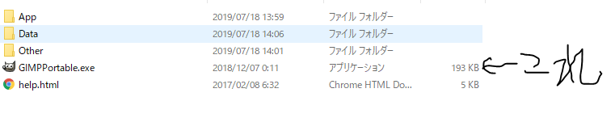
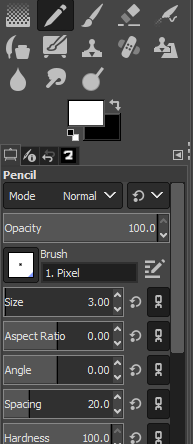

# 実際にやってみよう

## 学習
今回の講座は、0から1の数字を識別する教師あり学習の画像分類です。  
教師あり学習とは、正解の情報付きのデータを学習することです。  
0から9までの画像に正解の情報をつけて学習します。  
学習に用いるデータはmnistという0から9の画像です。  
数は学習用の60000個と、検証用の10000個です。  

<br>
この画像は一つ一つ28x28の2値化処理されたものになっています。  
学習の前に先程のニューラルネットワークを見てみましょう。  
フォルダ内のNN.pyをメモ帳で開いてみましょう。  
```python
import chainer #機械学習で使うライブラリ
from chainer import Chain
import chainer.links as L
import chainer.functions as F

# DNN class
class DNN(Chain):
    def __init__(self):
        super(DNN, self).__init__(
            l1 = L.Linear(784,256), #28x28=784
            l2 = L.Linear(256,128),
            l3 = L.Linear(128,10) #出力は0から9の10
        )
    def forward(self,x):
        h1 = F.relu(self.l1(x))
        h2 = F.relu(self.l2(h1))
        h3 = self.l3(h2)
        return h3
```
mnistの画像は28x28なので、入力を784個にします。  
出力は0から9の10種類なので、出力は10個です。  
では学習しましょう。  

```
C:\User\Desktop\kouza10-26>python kouza_train.py
epoch: 1, loss: 0.8464616...
epoch: 2, loss: 0.5646165...
.....
accuracy: 0.9797
```
ここのepochは学習が何回目かを示し、lossは目標との差を示します。  
accuracyとは正解率のことで、  
60000個からできたニューラルネットワークに10000個の検証データを  
判定させたものです。

<br>
フォルダ内にmnist_model.npzというファイルができたと思います。  
これが学習でできた重みやバイアスが入っているファイルです。  
<br>
なお、mnistの70000個のデータはどこにあるかというと、  
ローカルディスクの.chainer>dataset>pfnet>chainer>mnistにあります。  

<br>

## 判定
次は実際に自分で手書き数字を描いて判定してみましょう。  
フォルダ内のGimPPortableを開いてGIMPPortable.exeを起動しましょう。  

<br>

<br>
ファイルの新しい画像の生成をクリックしてください。  

<br>
幅と高さをmnistのデータに合わせて変更します。  
詳細設定をクリックして色空間をグレースケールに、  
コメントは消しましょう。  

ペンを選んでsizeを3.0にします。  
書いてみましょう。  

<br>
描いたらCtrl + Shift + E を押してください。  

<br>
フォルダ内のtest_dataを選択し、ファイル名を描いた数字.pngにして  
エクスポートします。  
これを0から9まで書きましょう。  
完了したら、コマンドでkouza_test.pyを実行しましょう。  
```
C:\User\Desktop\kouza10-26>python kouza_test.py
test file = 0.png , label = 0,test result = 0,OK
test file = 1.png , label = 1,test result = 7,NG
test file = 2.png , label = 2,test result = 3,NG
..........
OK 3,NG 6,Total 10
accurcy: 30.0%
```
判定が出たと思います。  
恐らく正解率は低いと思います。  


<br>
[前へ](../03third/page.md)・[次へ](../05fin/page.md)
<br>
<br>
[HOME](../index.md)
